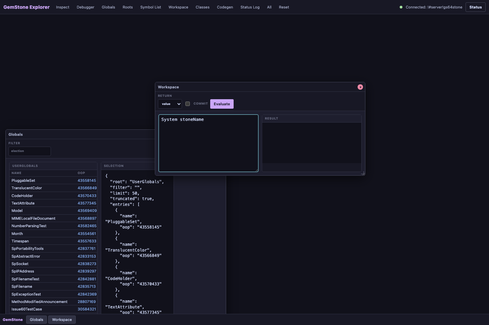
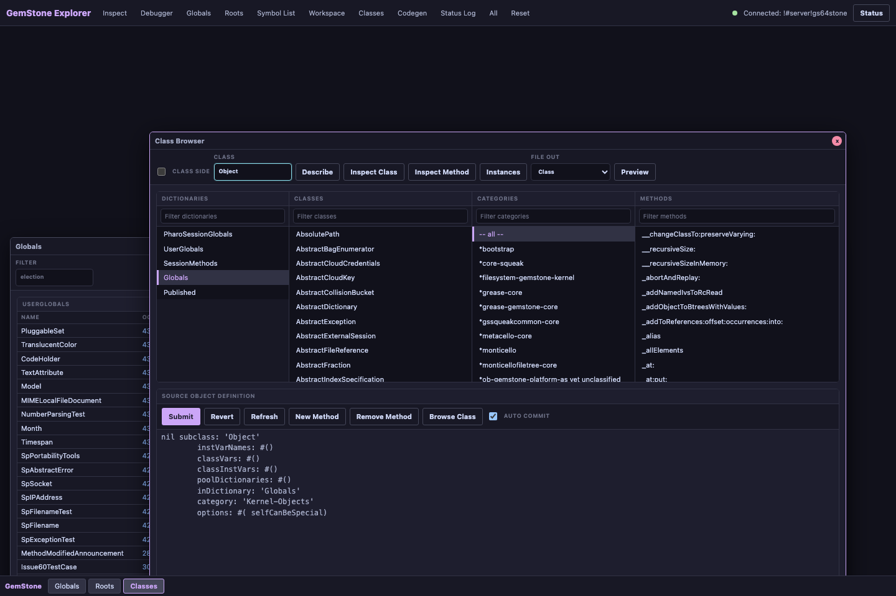
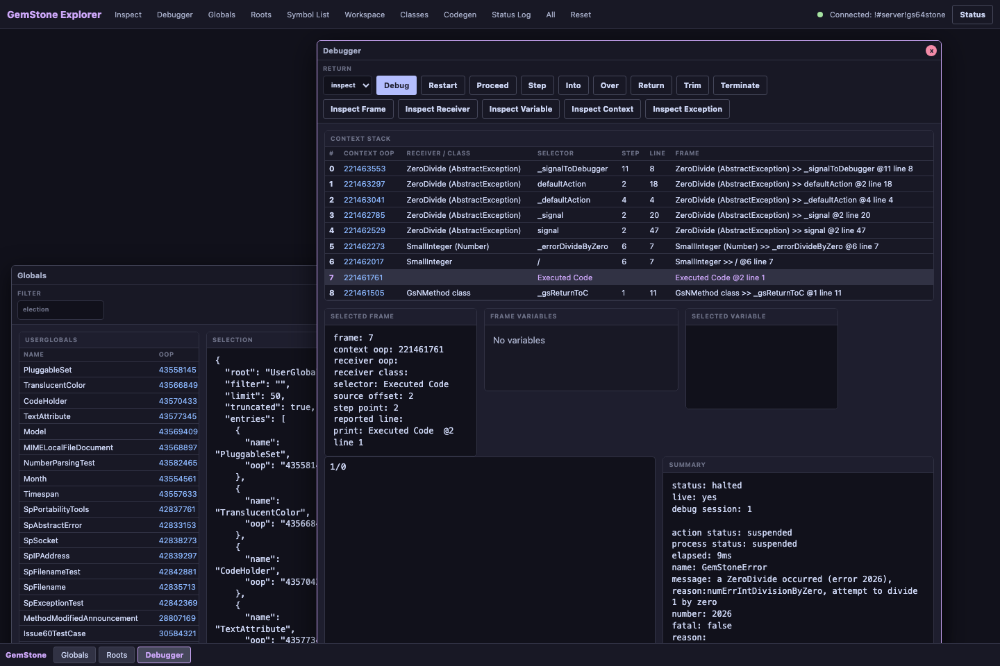
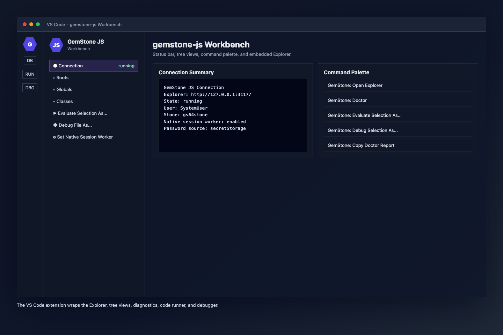

# Building a JavaScript Workbench for GemStone/S

_A practical look at `gemstone-js`, the Explorer UI, and the VS Code extension that turns GemStone/S into a JavaScript-native development workflow._



GemStone/S has always rewarded developers who are comfortable living close to the object database. The hard part for many modern teams is not the database model itself. It is the tooling boundary around it: JavaScript services, TypeScript wrappers, npm release flows, CI checks, and editor workflows all need a clear path into the Stone.

`gemstone-js` is that bridge. It is an async TypeScript client for GemStone/S, with a native GCI backend, high-level session helpers, generated wrappers, web adapters, query helpers, migration tooling, release checks, and a browser-based Explorer. The newer VS Code workbench wraps that Explorer so developers can inspect, evaluate, debug, and browse GemStone objects without leaving their editor.

This article walks through the current shape of the project and the decisions behind the workbench.

## The Goal

The goal is not to hide GemStone behind a generic ORM. GemStone is an object database, and the API should preserve that reality.

The JavaScript side needs to make common work explicit:

- connect to a Stone with clear environment variables
- send selectors and evaluate Smalltalk
- marshal JavaScript strings, numbers, arrays, dictionaries, and typed object handles
- inspect OOPs and object structure
- work with persistent roots, globals, dictionaries, arrays, and ordered collections
- generate typed wrappers from manifests or decorators
- test locally with a mock runtime and opt into live Stone regression tests
- run production calls through a safer native session-worker backend

That is the core contract: keep the GemStone model visible, but make the JavaScript workflow predictable.

## The Explorer

The Explorer is a local browser UI served by `examples/explorer.ts`. It gives the project a concrete development surface instead of only a library API.

It includes:

- connection status and Doctor diagnostics
- workspace evaluation with selectable return kinds
- roots and globals browsing
- object inspection by OOP
- class browsing and method source editing
- generated-wrapper preview
- debugger panels for exception contexts



The class browser is intentionally close to the Python explorer workflow: list classes, select a method, preview source, edit, and submit. Description and file-out views are available when needed, but the main surface stays focused on browsing and editing.

## Debugging `1/0`

Debugging is where the Explorer becomes more than a convenience UI. When evaluation raises, the workbench can open the debugger automatically. A simple `1/0` gives a live exception context with stack frames, locals, receiver details, and action buttons.



The debugger supports the operations developers expect first:

- continue
- restart
- step over
- step in
- step out
- selected-frame-aware actions
- source previews from GemStone context frames
- receiver, locals, context OOP, and exception OOP display

The debugger is deliberately thin. Session semantics remain owned by the Explorer and GemStone APIs; VS Code is a client surface.

## The VS Code Wrapper

The VS Code extension started as a wrapper around the JavaScript Explorer rather than a completely separate UI. That was the right tradeoff.



The extension now provides:

- `GemStone: Open Explorer`
- `GemStone: Doctor`
- `GemStone: Evaluate Selection`
- `GemStone: Evaluate Selection As...`
- `GemStone: Run File` and `Run File As...`
- `GemStone: Debug Selection` and `Debug Selection As...`
- `GemStone: Debug File` and `Debug File As...`
- connection, roots, globals, and classes tree views
- object/class copy and inspect commands
- SecretStorage-backed password handling
- redacted connection and Doctor report copy commands
- quick settings for default return kind, Explorer open mode, and native session-worker mode

That gives the developer a familiar editor workflow without duplicating the Explorer's core features.

## Why Return Kinds Matter

One of the most useful small details is return-kind selection.

When evaluating Smalltalk, developers often need different result shapes:

- `inspect` for a structured object inspection payload
- `value` for JavaScript value marshalling
- `oop` for a raw object handle

The workbench has a default return kind, but the `As...` commands let developers choose per action. That avoids a noisy settings loop when switching between quick checks, object inspection, and wrapper development.

## Object Mapping Without an ORM

`gemstone-js` does support object mapping, but it does not try to make GemStone look like a generic JavaScript ORM.

The current model has three practical layers.

First, common JavaScript values are marshalled through `performWith()` and generated wrappers: strings, numbers, booleans, arrays, plain objects, dictionaries, and retained object handles cross the boundary without every caller manually allocating GemStone objects.

Second, live GemStone objects are represented as explicit handles:

```ts
import { Session, type TypedOop } from "gemstone-js";

interface Booking {
  id: string;
  status: string;
}

const session = await Session.connect();
const booking: TypedOop<Booking> = await session
  .classRef<Booking>("Booking")
  .sendObject("find:", "B-1001");

const status = await booking.send<string>("status");
await booking.send("status:", "confirmed");
await session.commit();
```

That `TypedOop<Booking>` is a retained remote object handle with a TypeScript witness. It is not a hydrated local `Booking` instance. Selector sends are still visible, async, and transaction-bound.

Third, generated wrappers turn those selector sends into application-facing functions:

```ts
export async function findBooking(
  session: Session,
  id: string,
): Promise<TypedOop<Booking>> {
  return session.classRef("Booking").sendObject("find:", id);
}
```

For a more transparent syntax, `mappedObject()` wraps the retained handle with async property-style methods:

```ts
import { mappedObject } from "gemstone-js";

const booking = mappedObject<Booking, {
  setStatus(status: string): Promise<unknown>;
}>(bookingObject, {
  setters: { setStatus: "status:" },
  snapshot: ["id", "status"],
});

const before = await booking.status();
await booking.setStatus("confirmed");
const payload = await booking.$snapshot();
```

That is intentionally not `await booking.status` or `booking.status = "confirmed"`. JavaScript property access is synchronous, but GemStone selector sends are remote and transaction-bound.

For relationships and richer payloads, the same proxy can distinguish value, object, raw OOP, and dictionary readback explicitly:

```ts
import { mappedObject, type Oop, type TypedOop } from "gemstone-js";

const booking = mappedObject<Booking, {
  customer(): Promise<TypedOop<Customer>>;
  customerOop(): Promise<Oop>;
}>(bookingObject, {
  objectSelectors: { customer: "customer" },
  oopSelectors: { customerOop: "customer" },
  snapshot: {
    id: "id",
    status: "status",
    customer: { selector: "customer", kind: "oop" },
    details: { selector: "details", kind: "dict", maxEntries: 100 },
  },
});

const customer = await booking.customer();
const payload = await booking.$snapshot();
```

That gives the application a clear choice: keep a retained handle when it wants GemStone-side behavior, use a raw OOP when identity is enough, or produce a bounded snapshot when sending data to a UI or API.

For payload-style mapping, class instances can be converted explicitly into GemStone dictionaries:

```ts
import {
  Session,
  objectToDictionaryArgument,
  scalarValueConverterRegistry,
} from "gemstone-js";

class BookingDraft {
  constructor(
    public id: string,
    public status: string,
    public requestedAt: Date,
  ) {}
}

const session = await Session.connect({
  valueConverters: scalarValueConverterRegistry(),
});

const draft = new BookingDraft("B-1001", "held", new Date());
const payload = objectToDictionaryArgument(draft);
const booking = await session
  .classRef<Booking>("Booking")
  .sendObject("createFromDictionary:", payload);
```

Dictionaries are the other common mapping target. A `StringKeyValueDictionary` can hold marshalled values, nested dictionaries, and object handles while keeping the access mode explicit:

```ts
import { PersistentRoot } from "gemstone-js";

const dict = await session.dictionary({
  status: "held",
  tags: ["vip", "late-arrival"],
  limits: { guests: 2, bags: 3 },
});

await dict.setObject("booking", booking);
await dict.setAllValue({
  owner: "front-desk",
  priority: 3,
});

const status = await dict.requireValue("status");
const sameBooking = await dict.requireObject<Booking>("booking");
const limits = await dict.requireDict("limits");
const entries = await dict.items({ maxEntries: 50 });
const rawEntries = await dict.itemsOop({ maxEntries: 50 });

const root = PersistentRoot.userGlobals(session);
const index = await root.setDict("BookingIndex", {
  kind: "booking-index",
  active: true,
});

await index.setObject("B-1001", sameBooking);
await root.setObject("LastBooking", sameBooking);
```

The API names do real work here. `Value` methods marshal back to JavaScript values, `Object` methods return retained `TypedOop<T>` handles, `Oop` methods preserve raw identity, and `Dict` methods wrap nested dictionaries.

This is the same bias as the rest of the project: preserve GemStone identity and transaction semantics, but make the JavaScript boundary typed, repeatable, and easy to review.

With `mappedObject()` in place, the next mapping step should borrow the useful part of the Pharo bridge connector model without copying its transparent synchronization semantics. The shape is straightforward:

- mapping manifest schema for class name, TypeScript type, selectors, setters, repository selectors, and snapshot fields
- generated `BookingRef`-style classes wrapping `TypedOop<T>` or delegating to `mappedObject()`
- repository helpers returning typed refs
- bounded `snapshot()` and dictionary helpers for UI/API payloads
- Explorer and VS Code mapping views over committed manifests and generated files

That would let application code say:

```ts
const bookings = new BookingRepository(session);
const booking = await bookings.find("B-1001");

await booking.setStatus("confirmed");
const payload = await booking.snapshot();
```

The important constraint is that `status()` and `setStatus()` stay async remote calls. The mapping layer should make selector use nicer, not pretend the GemStone object is a local JavaScript object.

## Native Worker Mode

The native backend is the main production hardening area. The raw GCI binding remains useful for low-level troubleshooting, but production trials should use the native session worker when possible.

The worker model queues calls for a session through a dedicated native worker boundary. This is a better fit for blocking native calls and GemStone session expectations, and it keeps JavaScript call sites async.

The workbench exposes this as a quick setting:

```text
GemStone: Set Native Session Worker
```

Changing it stops the managed Explorer so the next launch uses the new mode.

## Release Confidence

The project now treats release proof as part of the library, not an afterthought.

The local verification path checks:

- TypeScript typecheck
- codegen manifest output
- decorator scanner output
- examples catalog
- comparison reports
- public API surface
- runtime API contract
- unit tests
- live-test guard coverage
- checksum and provenance helpers
- package artifact review
- installed API contract

The VS Code workbench has its own verify path that checks syntax, offline extension activation, command registration, VSIX packaging, artifact contents, and optional extension-host smoke tests.

## What This Enables

The important shift is that GemStone/S work can now sit inside a modern JavaScript delivery loop:

- write TypeScript services
- generate typed wrappers for GemStone selectors
- run local tests without a live Stone
- opt into live Stone regression checks
- inspect production-shaped objects through the Explorer
- debug exceptions from VS Code
- publish npm packages with artifact/provenance checks

That does not make GemStone less GemStone. It makes the surrounding workflow easier to ship and trust.

## What Comes Next

The next valuable work is less about adding more small commands and more about hardening:

- deeper live regression coverage
- stronger native worker stress tests
- installed-package smoke checks across target platforms
- Marketplace release polish for the VS Code extension
- connector-inspired object mapping with generated `*Ref` classes and snapshot helpers
- more visual Explorer workflows once the core debugger/class browser semantics settle

The workbench is already useful as a wrapper around the Explorer. That is the right MVP. From there, the extension can grow into a richer GemStone development environment without losing the tested browser UI beneath it.

## Links

- `gemstone-js`: https://github.com/unicompute/gemstone-js
- VS Code workbench package: `vscode-gemstone-js-workbench`
- Generated PDF bundle: `docs/pdf`
