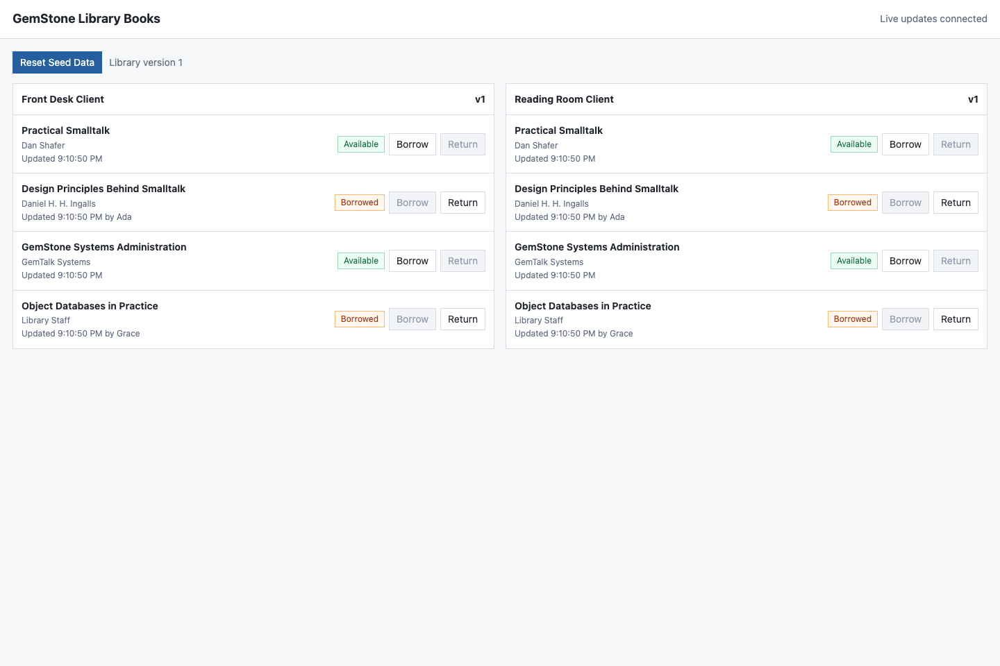

# Examples Guide

`gemstone-js` ships a small installed example catalog. The catalog is meant to
serve two jobs: quick local discovery from an installed package, and stable file
paths that release checks can verify before publishing.

## Discovery

```sh
gemstone-js-examples
gemstone-js-examples --json
gemstone-js-examples --kind web
gemstone-js-examples --commands
gemstone-js-examples --plans
```

Use `--show <name>` to print a packaged example and `--path <name>` to resolve
its installed file path:

```sh
gemstone-js-examples --show quickstart
gemstone-js-examples --path web-fetch
```

The command list intentionally includes only examples that can be run directly.
Reference fixtures such as generated wrapper output and route-handler modules
stay visible in the catalog but do not get direct run commands.

Installed-package smoke checks should resolve examples through the CLI instead
of assuming checkout-relative paths:

```sh
gemstone-js-examples --show quickstart
gemstone-js-examples --show codegen-manifest
gemstone-js-examples --show booking-decorators
```

## Guided Plans

The plan view groups examples by workflow:

```sh
gemstone-js-examples --plan first-session
gemstone-js-examples --commands --plan data-persistence
gemstone-js-examples --json --plan web-service
```

Current plans:

- `first-session`: connect, run the MagLev branch compatibility session
  example, evaluate, and write/read ObjectLog entries.
- `data-persistence`: roots, simple dictionaries, query helpers, bulk selector
  sends, transparent object mapping, GStore, and migrations.
- `typed-codegen`: manifests, decorated source, and generated wrappers.
- `web-service`: Fetch, local explorer, route-handler, Express, Fastify, and
  Hono shapes.
- `ops-release`: migration, ObjectLog, and codegen checks used before release.

## Environment

Live examples use the same `GS_*` environment as `Session.configFromEnv()`:

```sh
export GS_STONE=gs64stone
export GS_NETLDI=netldi
export GS_HOST=localhost
export GS_USERNAME=DataCurator
export GS_PASSWORD=swordfish
```

The canonical JavaScript names above take precedence. Existing Pharo bridge
shells can use `GS_USER`, `GS_PASS`, `GS_NETLDI_HOST`,
`GS_NETLDI_NAME_OR_PORT`, and `GS_SERVICE` as compatibility aliases.
If login still reports an invalid user/password after a password change, update
or unset the canonical value first: `GS_PASSWORD` wins over `GS_PASS`, and
`GS_USERNAME` wins over `GS_USER`.
Set `GS_NATIVE_SESSION_WORKER=1` when you want examples that call
`Session.connect()` to use the optional Node `GciSessionWorker` backend instead
of the raw `Gci` backend.

The committed check path does not connect to GemStone:

```sh
npm run examples:check
npm run live:check
```

That check syntax-checks TypeScript examples, parses JSON examples, validates
catalog metadata, validates guided plans, and fails if an example file is not in
the catalog. The live-smoke guard does not connect to GemStone; it runs the
`tests/live.test.ts` skip path and verifies that the opt-in live regression keeps
covering connection setup, arrays, dictionaries, globals, persistent roots,
GStore, query helpers, and migrations.

Use `npm run test:live:worker` to run the same opt-in live suite with
`GS_NATIVE_SESSION_WORKER=1`.

## MagLev Branch Example

`examples/maglev-branch-usage.ts` mirrors the session examples from
`GemStone-Pharo-Bridge/doc/MAGLEV-BRANCH-USAGE.md` in JavaScript form. It uses
`GbsSessionParameters`, `session.userGlobals`, `session.bridgeRoot`,
`session.commit()`, `session.commitTransactionOrSignalConflict()`, and
`session.disconnect()` so existing GemStone-Pharo-Bridge users can see the
closest equivalent shape before moving to lower-level `Session` and
`PersistentRoot` APIs.

## Codegen Examples

The generated wrapper examples are committed so they can be reviewed like
normal source:

```sh
npm run codegen:check
npm run codegen:scan:check
```

`examples/codegen.manifest.json` demonstrates typed imports, typed arguments,
array and dictionary argument marshalling, value returns, raw OOP returns, and
retained typed-object returns. `examples/booking.decorators.ts` exercises the
decorator scanner and emits `examples/booking.decorators.generated.ts`.

For the broader object-mapping model, including `TypedOop<T>` handles,
generated selector wrappers, dictionary payload conversion, and value
converters, see `docs/object-mapping.md`.

`examples/simple-dictionary.ts` is the smallest persistent dictionary example:
`Session.withEnv()` owns login/logout, `globalSetDict()` stores a GemStone
dictionary in `UserGlobals`, `commit()` makes it durable, and
`globalRequireDictObject()` reads it back as a bounded JavaScript snapshot.

```ts
import { Session } from "gemstone-js";

const key = "MyTestDict";

await Session.withEnv(async (session) => {
  await session.globalSetDict(key, {
    name: "Tariq",
    amount: 100,
    currency: "GBP",
  });
  await session.commit();
});

const saved = await Session.withEnv((session) =>
  session.globalRequireDictObject(key, { maxEntries: 50 })
);

console.log(saved);
// { name: "Tariq", amount: 100n, currency: "GBP" }
```

`examples/external-structure-dictionary.ts` shows the next step: build and
manipulate application data before opening a GemStone session, then commit it
and read it back from a later session.

```ts
import { Session, objectToDictionaryArgument, type GemStoneArgument } from "gemstone-js";

class CheckoutDraft {
  readonly lines: Array<{ sku: string; quantity: number; unitPrice: number }> = [];
  discount = 0;

  constructor(
    readonly id: string,
    readonly customerName: string,
    readonly currency: string,
  ) {}

  addLine(sku: string, quantity: number, unitPrice: number): void {
    this.lines.push({ sku, quantity, unitPrice });
  }

  get total(): number {
    return this.lines.reduce((sum, line) => sum + line.quantity * line.unitPrice, 0) - this.discount;
  }
}

const checkout = new CheckoutDraft("CHK-1001", "Tariq", "GBP");
checkout.addLine("GS-JS-SUPPORT", 2, 45);
checkout.addLine("GS-EXPLORER", 1, 25);
checkout.discount = 15;

const metadata: Record<string, GemStoneArgument> = { source: "node" };
metadata.reviewed = true;

const payload = objectToDictionaryArgument({
  id: checkout.id,
  customerName: checkout.customerName,
  currency: checkout.currency,
  lineCount: checkout.lines.length,
  skus: checkout.lines.map((line) => line.sku),
  total: checkout.total,
  metadata,
});

await Session.withEnv(async (session) => {
  await session.globalSetDict("ExternalCheckoutExample", payload);
  await session.commit();
});

const committed = await Session.withEnv(async (session) => {
  const stored = await session.globalRequireDict("ExternalCheckoutExample");
  const values = await stored.pick(["id", "customerName", "currency", "lineCount", "skus", "total"]);
  const nested = await stored.pickDict(["metadata"]);
  return {
    ...values,
    metadata: nested.metadata ? await nested.metadata.toObject({ maxEntries: 20 }) : null,
  };
});

console.log(committed);
```

`examples/deconstructed-transactions.ts` breaks transaction work into smaller
database phases. It is useful when you want to see exactly where GemStone state
is dirty, committed, aborted, retried, or nested:

```ts
import {
  CommitConflictError,
  GStore,
  GStoreAbortTransaction,
  PersistentRoot,
  Session,
  commitWithConflictDetails,
  nestedTransaction,
  runTransactionWithRetry,
} from "gemstone-js";

await using session = await Session.connect(Session.configFromEnv());
const root = PersistentRoot.userGlobals(session);

await root.setDict("TxnManualCommitExample", { status: "draft" });
console.log(await session.needsCommit().catch((error) => `unavailable: ${error.message}`));
await session.commit();

try {
  await root.setValue("TxnManualAbortExample", "discard me");
  throw new Error("application validation failed");
} catch {
  await session.abort();
}

await session.withTransaction(async (transactionSession) => {
  await PersistentRoot.userGlobals(transactionSession).setDict("TxnScopedExample", {
    status: "committed-by-withTransaction",
  });
});

try {
  await session.withTransaction(async (transactionSession) => {
    await PersistentRoot.userGlobals(transactionSession).setValue("TxnScopedRollbackExample", "discarded");
    throw new Error("rollback scoped transaction");
  });
} catch {
  console.log(await root.has("TxnScopedRollbackExample"));
}

let commitAttempts = 0;
await runTransactionWithRetry(
  async (transactionSession) => {
    await PersistentRoot.userGlobals(transactionSession).setDict("TxnRetryExample", {
      status: "committed-after-retry",
    });
  },
  {
    session,
    attempts: 2,
    commit: async (transactionSession) => {
      commitAttempts += 1;
      if (commitAttempts === 1) throw new CommitConflictError("simulated conflict");
      await commitWithConflictDetails(transactionSession);
    },
  },
);

try {
  await nestedTransaction(session, async (nestedSession) => {
    await PersistentRoot.userGlobals(nestedSession).setValue("TxnNestedInnerExample", "discarded");
    throw new Error("abort only the nested level");
  });
} catch {
  await root.setValue("TxnNestedOuterExample", "outer transaction kept going");
  await session.commit();
}

await root.setDict("TxnVisibilityExample", { status: "uncommitted" });
console.log(await root.has("TxnVisibilityExample"));
console.log(await Session.withEnv((other) =>
  PersistentRoot.userGlobals(other).has("TxnVisibilityExample")
));
await session.commit();
console.log(await Session.withEnv((other) =>
  PersistentRoot.userGlobals(other).getDictObject("TxnVisibilityExample")
));

const store = await GStore.open(session, "TxnGStoreAbortExample");
await store.transaction((transaction) => {
  transaction.set("keep", { status: "committed" });
});
await store.transaction((transaction) => {
  transaction.set("keep", { status: "discarded" });
  transaction.set("temporary", true);
  throw new GStoreAbortTransaction();
});
console.log(await store.transaction((transaction) => transaction.toObject(), { readOnly: true }));
```

`examples/object-mapping.ts` shows `mappedObject()` with async property-style
methods, setter selectors, object selectors, and snapshots. The guide expands
that example into a mapping decision table, explicit selector configuration,
relationship handle mapping, dictionary-backed snapshot fields, and a
production checklist for live Stone usage. It also documents root/global
mapping, retained-handle lifetime rules, and the migration path from direct
`TypedOop<T>.send()` calls to proxy options and generated `*Ref` classes.

`examples/transparent-object-mapping.ts` shows the higher-transparency proxy:
`await booking.status`, callable selector accessors, relationship handles,
queued writes through `$assign()`/`$flush()`, bounded snapshots, and
request-scoped identity reuse through the same mapping API.

`examples/object-mapping.manifest.json` is the first committed mapping
manifest. It describes a `BookingRef`, selector methods, a setter, bounded
snapshot fields, and a repository method returning a typed ref. The manifest is
schema-backed by `schemas/object-mapping-manifest.schema.json`; generated
`BookingRef` output is the next step.

`examples/smalltalk-bridge.ts` shows the Python-style dynamic bridge:
`smalltalkBridge(session)`, lazy global proxies, awaitable selector properties,
`st.Array.new_(3)` underscore-to-colon selector dispatch, exact `$send*()`
controls, and selector object results wrapped directly as transparent proxies.

The next planned examples should cover generated `BookingRef`-style classes
around `TypedOop<T>`, repository helpers returning typed refs, and bounded
snapshot/dictionary payload helpers. Those examples should remain generated
and committed so mapping behavior is reviewable in CI.

## Web Examples

The dependency-free Fetch example is the smallest web service shape:

```sh
node --experimental-strip-types examples/web-fetch.ts
```

`examples/library-books.ts` is a dependency-free browser app that demonstrates
GemStone-backed shared state with automatic client updates. It stores a small
library catalog in `GStore`, renders two client screens, and uses Server-Sent
Events so both screens update immediately when either client borrows or returns
a book:

```sh
node --experimental-strip-types examples/library-books.ts
open http://127.0.0.1:3027/
```



Open the same URL in two browser windows to see the same behavior across real
clients. The current catalog lives under `UserGlobals.GStoreRoot` as
`ExampleLibraryBooks`; use the page's reset button to restore the seed books.
`node --experimental-strip-types --check examples/library-books.ts` only
syntax-checks the example and exits immediately; omit `--check` when you want
to start the server.


The dependency-free browser explorer is a small local workbench for status,
doctor output, OOP inspection, roots/globals, workspace eval, class browsing,
and generated-wrapper preview:

```sh
node --experimental-strip-types examples/explorer.ts
```

Framework examples show the same request/session lifecycle through common Node
frameworks:

```sh
npm install express
node --experimental-strip-types examples/web-express.ts

npm install fastify
node --experimental-strip-types examples/web-fastify.ts

npm install hono @hono/node-server
node --experimental-strip-types examples/web-hono.ts
```

Route-handler frameworks can start from `examples/web-route-handler.ts`, which
exports `GET()` and `POST()` functions around the Fetch adapter.
