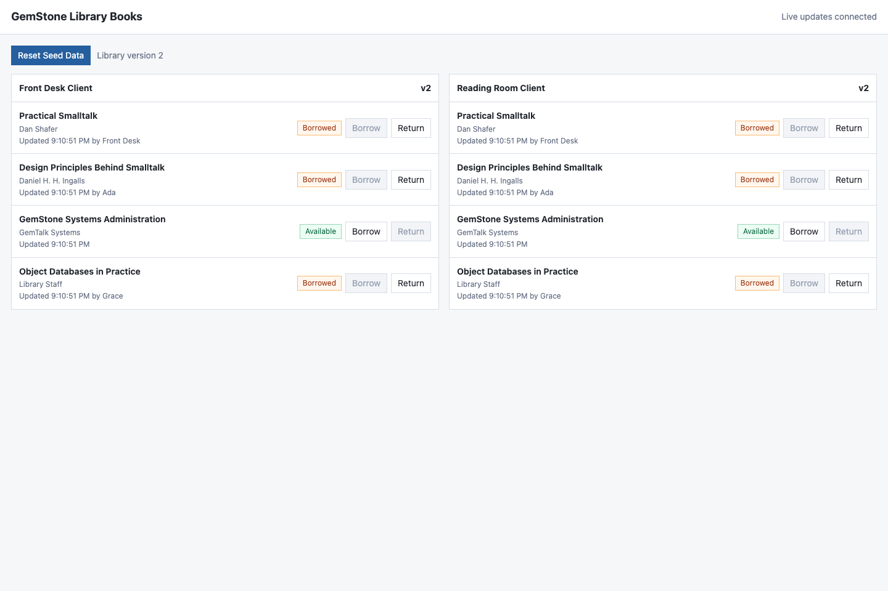

# Framework Adapters

`gemstone-js` keeps framework integration thin. Express, Fastify, Fetch API,
and Hono all delegate request lifetime to `RequestScope`, so transaction
policy, pool release, abort-on-error, abort-on-status, and owned-session logout
stay in one place.

## Request Lifecycle

The adapters attach the active `Session` and `RequestScope` to the framework
request context:

| Framework | Session handle | Scope handle |
| --- | --- | --- |
| Express | `req.gemstoneSession` | `req.gemstoneScope` |
| Fastify | `request.gemstoneSession` | `request.gemstoneScope` |
| Fetch API | `context.session` | `context.scope` |
| Hono | `c.get("gemstoneSession")` | `c.get("gemstoneScope")` |

By default, successful responses commit and failed responses abort. A response
status greater than or equal to `serverErrorStatus` is treated as failed. Use
`transactionPolicy: "abortOnExit"` for read-mostly routes that should always
discard changes, or `transactionPolicy: "manual"` when handlers commit or abort
explicitly.

## Examples

Each example uses a shared `SessionPool`, exposes `/health/gemstone`, writes an
`ObjectLog` entry at `POST /object-log`, and closes the pool on process
shutdown:

```sh
gemstone-js-examples
gemstone-js-examples --show web-express
```

```sh
npm install express
node --experimental-strip-types examples/web-express.ts
```

```sh
npm install fastify
node --experimental-strip-types examples/web-fastify.ts
```

```sh
node --experimental-strip-types examples/web-fetch.ts
```

The live library-books example is also dependency-free. It uses a plain Node
HTTP server, persists book availability in GemStone through `GStore`, and uses
Server-Sent Events so multiple browser clients show the same available/borrowed
state as soon as it changes:

```sh
node --experimental-strip-types examples/library-books.ts
open http://127.0.0.1:3027/
```



Use the command above to start the server. The `node --experimental-strip-types
--check examples/library-books.ts` form is only a syntax check and exits
immediately.

Route-handler style frameworks that expose standard `Request`/`Response`
functions can start from `examples/web-route-handler.ts`. It exports `GET()` and
`POST()` functions around the same Fetch adapter and marks the route as a Node
runtime for frameworks that distinguish Node from edge execution.

```sh
npm install hono @hono/node-server
node --experimental-strip-types examples/web-hono.ts
```

The examples rely on the usual GemStone environment variables accepted by
`Session.configFromEnv()`: `GS_STONE`, `GS_NETLDI`, `GS_HOST`,
`GS_USERNAME`, `GS_PASSWORD`, and related host-login settings. Pharo bridge
aliases are accepted too: `GS_USER`, `GS_PASS`, `GS_NETLDI_HOST`,
`GS_NETLDI_NAME_OR_PORT`, and `GS_SERVICE`. Canonical JavaScript names win if
both forms are set, so update `GS_PASSWORD` directly when changing the live
GemStone password.
`npm run examples:check` syntax-checks the committed examples without requiring
the optional framework packages to be installed.
`gemstone-js-examples --commands --kind web` prints the install and run commands
for the runnable web examples from an installed package.
The opt-in live regression, `GS_RUN_LIVE=1 npm run test:live`, also exercises
`SessionPool`, `withSessionScope()`, and the Fetch adapter against a real Stone
so commit-on-success and abort-on-status behavior are covered below the mock
adapter tests.

## Adapter Notes

Pass an existing `SessionPool` when the framework owns process lifetime and
needs explicit startup/shutdown hooks. Passing pool options directly to the
adapter is useful for small services where the adapter can own the pool.
The Fetch adapter returns an app function with `.pool` and `.close()` so small
Node services can still warm and close the owned pool explicitly.

Do not retry an already-running HTTP request scope after a commit conflict
unless the entire request body and external side effects can be replayed. Use
`retryingTransaction()` around a smaller idempotent unit of work instead.
